# Database Schema & Storage Design

The `nse-archive` database schema is defined in TypeScript using [Drizzle ORM](file:///c:/www/wwwroot/dev/nse_archive/src/db/schema.ts) and deployed to PostgreSQL.

---

## Entity Relationship Diagram

```mermaid
erDiagram
    securities {
        int id PK "serial"
        text symbol "NOT NULL"
        text exchange "DEFAULT 'NSE'"
        text isin
        text provider_token
        text series
        text name
        text sector
        text industry
        int lot_size
        numeric price_band_pct "numeric(5,2)"
        text surveillance
        date listed_on
        date delisted_on
        boolean is_active "DEFAULT true"
        boolean is_primary "DEFAULT true"
        timestamp updated_at "DEFAULT now()"
        boolean is_quarantined "DEFAULT false"
        text quarantine_reason
        timestamp quarantined_at
    }

    daily_candles {
        bigint id PK "bigserial"
        text symbol "NOT NULL"
        text series "NOT NULL DEFAULT 'EQ'"
        date trade_date "NOT NULL"
        numeric open "numeric(12,2)"
        numeric high "numeric(12,2)"
        numeric low "numeric(12,2)"
        numeric close "numeric(12,2)"
        numeric prev_close "numeric(12,2)"
        bigint volume "NOT NULL"
        numeric traded_value "numeric(18,2)"
        int trades_count
        bigint delivery_qty
        numeric delivery_pct "numeric(5,2)"
        text source "NOT NULL"
        timestamp created_at "DEFAULT now()"
    }

    index_daily_close {
        bigint id PK "bigserial"
        text index_name "NOT NULL"
        date trade_date "NOT NULL"
        numeric open "numeric(12,2)"
        numeric high "numeric(12,2)"
        numeric low "numeric(12,2)"
        numeric close "numeric(12,2)"
        bigint volume
        numeric points_change "numeric(12,2)"
        numeric pct_change "numeric(6,2)"
        timestamp created_at "DEFAULT now()"
    }

    fo_daily_candles {
        bigint id PK "bigserial"
        text symbol "NOT NULL"
        text instrument_type "NOT NULL"
        date trade_date "NOT NULL"
        date expiry_date "NOT NULL"
        numeric strike_price "numeric(12,2)"
        text option_type
        numeric open "numeric(12,2)"
        numeric high "numeric(12,2)"
        numeric low "numeric(12,2)"
        numeric close "numeric(12,2)"
        numeric settle_price "numeric(12,2)"
        bigint open_interest
        bigint change_in_oi
        bigint volume "NOT NULL"
        numeric traded_value "numeric(18,2)"
        int trades_count
        int lot_size
        text source "NOT NULL"
        timestamp created_at "DEFAULT now()"
    }

    participant_activity {
        bigint id PK "bigserial"
        date trade_date "NOT NULL"
        text metric "NOT NULL"
        text client_type "NOT NULL"
        bigint future_index_long
        bigint future_index_short
        bigint future_stock_long
        bigint future_stock_short
        bigint option_index_call_long
        bigint option_index_put_long
        bigint option_index_call_short
        bigint option_index_put_short
        bigint option_stock_call_long
        bigint option_stock_put_long
        bigint option_stock_call_short
        bigint option_stock_put_short
        bigint total_long
        bigint total_short
        text source "NOT NULL"
        timestamp created_at "DEFAULT now()"
    }

    deals {
        bigint id PK "bigserial"
        date trade_date "NOT NULL"
        text deal_type "NOT NULL"
        text symbol "NOT NULL"
        text security_name
        text client_name "NOT NULL"
        text buy_sell "NOT NULL"
        bigint quantity "NOT NULL"
        numeric price "numeric(12,2)"
        text remarks
        text source "NOT NULL"
        timestamp created_at "DEFAULT now()"
    }

    ingestion_log {
        bigint id PK "bigserial"
        text source "NOT NULL"
        date trade_date "NOT NULL"
        text status "NOT NULL"
        int rows_written
        text error
        timestamp fetched_at "DEFAULT now()"
    }
```



---

## Tables Detail

### 1. `securities`
Master catalog of NSE-listed equities and instruments with non-null sector and industry categorizations.

- **Primary Key**: `id` (`serial`)
- **Unique Constraint**: `(symbol, exchange, series)`
- **Indexes**: `symbol`, `sector`, `industry`
- **Key Columns**:
  - `sector`: Broad macro economic sector (e.g. `Financials`, `Technology`, `Energy & Utilities`).
  - `industry`: Specific industry categorization (e.g. `Financial Services`, `Software`, `Oil Gas & Consumable Fuels`).
  - `surveillance`: Current ASM/GSM stage (e.g. `LT-ASM Stage I`, `ST-ASM Stage II`, `GSM Stage III`) or `null`.

---

### 2. `daily_candles`
Daily historical OHLCV, turnover, trade count, and delivery metrics.

- **Primary Key**: `id` (`bigserial`)
- **Unique Constraint**: `(symbol, series, trade_date)`
- **Indexes**: `(symbol, trade_date)`

---

### 3. `index_daily_close`
Daily close and point/percentage change values for indices (Nifty 50, Nifty Bank, Nifty IT, etc.).

- **Primary Key**: `id` (`bigserial`)
- **Unique Constraint**: `(index_name, trade_date)`

---

### 4. `fo_daily_candles`
Historical EOD candles for Futures & Options contracts (FUTSTK, FUTIDX, OPTSTK, OPTIDX).

- **Primary Key**: `id` (`bigserial`)
- **Unique Constraint**: `(symbol, instrument_type, expiry_date, strike_price, option_type, trade_date)`
- **Indexes**: `(symbol, trade_date)`

---

### 5. `participant_activity`
Aggregated Open Interest and Traded Volume breakdowns by participant category (`Client`, `DII`, `FII`, `Pro`).

- **Primary Key**: `id` (`bigserial`)
- **Unique Constraint**: `(trade_date, metric, client_type)`

---

### 6. `deals`
Bulk and block transactions published by the exchange.

- **Primary Key**: `id` (`bigserial`)
- **Unique Constraint**: `(trade_date, deal_type, symbol, client_name, buy_sell, quantity, price)`
- **Indexes**: `(symbol, trade_date)`

---

### 7. `ingestion_log`
Operational ledger and checkpoint tracker for all automated scraping jobs.

- **Primary Key**: `id` (`bigserial`)
- **Unique Constraint**: `(source, trade_date)`

---

## Migration Management

Migrations are handled with `drizzle-kit`:

```bash
# Generate SQL migration from src/db/schema.ts
npm run db:generate

# Execute pending migrations against DATABASE_URL
npm run db:migrate
```
