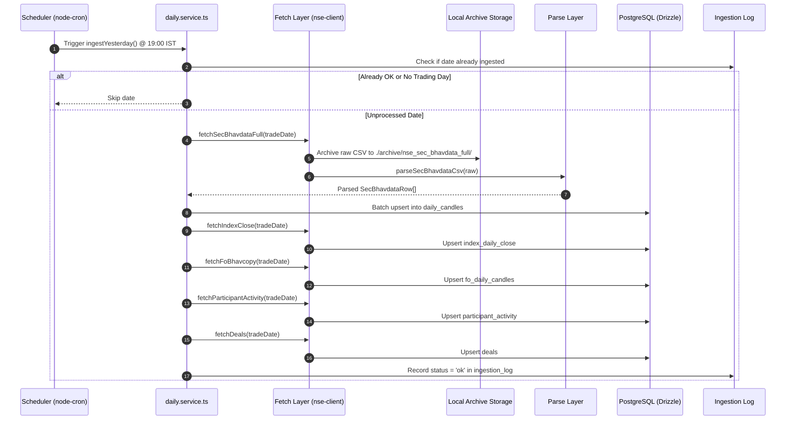
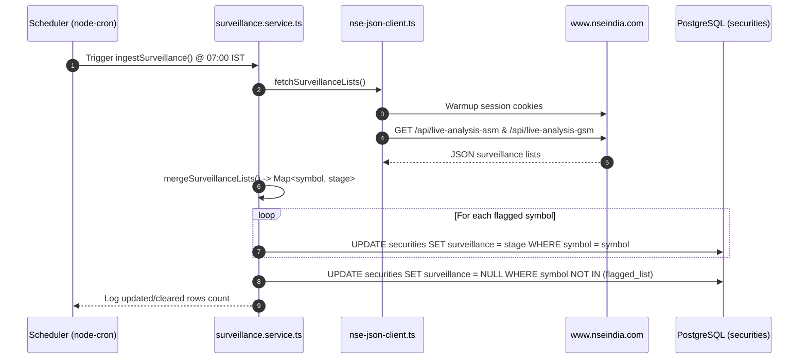
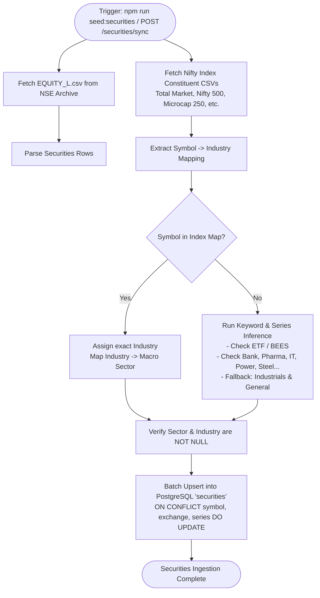
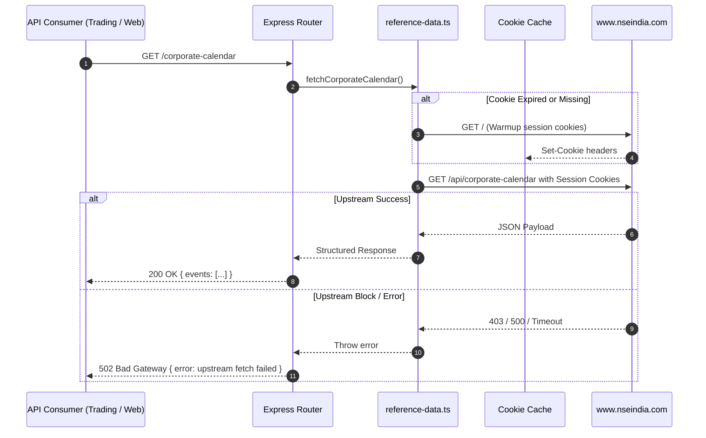

# Ingestion & Operational Workflows

This document details the step-by-step lifecycle for all data ingestion pipelines, background jobs, and upstream proxy workflows in `nse-archive`.

---

## 1. Daily EOD Ingestion Workflow (19:00 IST)

Runs every trading day after market close (~18:30 IST) when NSE publishes daily bhavcopy files.



---

## 2. Morning Surveillance (ASM/GSM) Workflow (07:00 IST)

Runs every trading morning before market open (09:00 IST) to synchronize the latest SEBI/NSE Enhanced Surveillance Measure (ESM), Additional Surveillance Measure (ASM), and Graded Surveillance Measure (GSM) stages into `securities.surveillance`.



---

## 3. Securities Master & Sector Classification Workflow

Fetches the complete directory of listed equities from NSE Archive, correlates index constituent files, and classifies all securities so that `sector` and `industry` fields are **guaranteed non-null**.



---

## 4. Historical Backfill Workflow

Iterates backward day-by-day from the current date to `BACKFILL_START_DATE` (e.g. `2024-01-01`), safely resuming and skipping previously completed dates.

```mermaid
flowchart TD
    START([Start Backfill]) --> READ_CHECKPOINTS[Query ingestion_log for Completed Dates]
    READ_CHECKPOINTS --> LOOP[Loop: currentDate = today down to BACKFILL_START_DATE]
    
    LOOP --> CHECK{currentDate in Checkpoints?}
    CHECK -->|Yes (ok or no_trading_day)| NEXT[currentDate = currentDate - 1 day]
    CHECK -->|No| ATTEMPT[Fetch & Ingest EOD Data for currentDate]
    
    ATTEMPT --> RESULT{HTTP Response}
    RESULT -->|200 OK| SAVE_DATA[Persist Candles & Mark Status = 'ok']
    RESULT -->|404 Not Found| MARK_HOLIDAY[Mark Status = 'no_trading_day']
    RESULT -->|Error / Timeout| LOG_FAIL[Mark Status = 'failed' with error message]
    
    SAVE_DATA --> NEXT
    MARK_HOLIDAY --> NEXT
    LOG_FAIL --> NEXT
    
    NEXT --> MORE{currentDate >= BACKFILL_START_DATE?}
    MORE -->|Yes| LOOP
    MORE -->|No| DONE([Backfill Finished])
```

---

## 5. Live Reference Data Upstream Proxying

Proxies live requests (holidays, announcements, corporate calendar, FII/DII flows) on demand:


